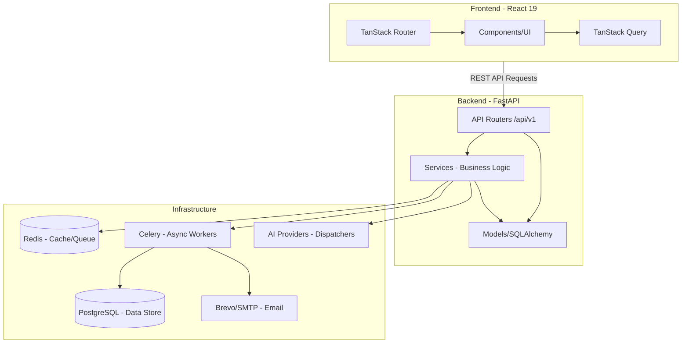

# SiraFit Architecture Map

This document serves as a persistent, high-level map of the SiraFit architecture to provide immediate context for development and troubleshooting.

## High-Level Architectural Graph

## Component Roles

| Layer | Component | Responsibility |
| :--- | :--- | :--- |
| **Frontend** | React/Router | SPA, SSR, UI, Type-Safe Routing |
| **API** | FastAPI | Router handlers, Request Validation, Authentication |
| **Logic** | Services | Orchestration, AI dispatching, PDF/Resume generation |
| **Persistence** | SQLAlchemy | ORM, PostgreSQL transactions, Migrations |
| **Async** | Celery | Distributed tasks, Queues, DLQ |
| **Infra** | Redis | Rate limiting, Caching, Task broker |

## Key Data Flows

1.  **Job Import:** User URL -> Frontend -> `API` -> `JobImportService` -> Normalization -> `Postgres`.
2.  **AI Analysis:** `Frontend` -> `API` -> `JobAnalysisService` -> `Celery` -> `AI Provider` -> `Postgres`.
3.  **Resume Gen:** `Frontend` -> `API` -> `ResumeService` -> `Celery` -> `AI` -> JSON/PDF -> `Postgres` -> `S3/Export`.
4.  **Status Tracking:** `Frontend` -> `API` -> `AppService` (status machine) -> `Postgres`.

## Development Principles

- **Modular Monolith:** Logic is separated into modules, but deployment is unified.
- **Async-First:** Heavy tasks (AI, PDF, Import) are enqueued to Celery.
- **Graceful Degradation:** Redis/Celery fallback to synchronous/in-memory if unreachable.
- **Security:** AI Keys encrypted via Fernet at rest.
