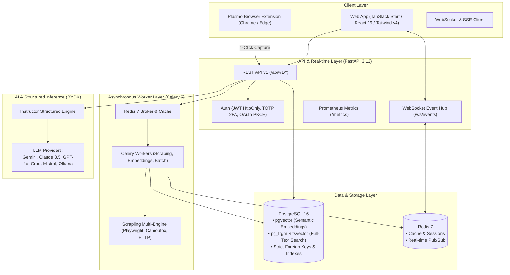

# SiraFit

<p align="center">
  
</p>

<p align="center">
  <strong>Deterministic, AI-powered career operations platform for engineers who actually ship.</strong>
</p>

<p align="center">
  <a href="#-architecture"></a>
  <a href="#-tech-stack"></a>
  <a href="#-tech-stack"></a>
  <a href="#-tech-stack"></a>
  <a href="#-tech-stack"></a>
  <a href="#-security--privacy"></a>
</p>

---

## 🚀 Overview

**SiraFit** is an enterprise-grade, deterministic career operations command center. Instead of manually wrestling with hundreds of job listings, spreadsheets, and brittle resume builders, SiraFit provides an automated, observable pipeline that ingests jobs across major boards, deterministically computes skill and seniority overlap with `pgvector` semantic search, builds tailored resume variants with visual diff/revert, and tracks applications through an automated Kanban pipeline with real-time notifications.

SiraFit is strictly **local-first and privacy-focused**: AI models generate structured content through typed schemas (via [Instructor](https://github.com/jxnl/instructor)), but rule-based algorithms and transparent vector mathematics decide scores and outcomes.

---

## 🏗 System Architecture



---

## ✨ 16-Sprint Production Feature Set

SiraFit has been engineered across 16 rigorous development sprints:

### 1. 🛡️ Authentication Hardening & Identity (Sprint 1)
- **Two-Factor Authentication (TOTP)**: RFC 6238-compliant authenticator app support with QR code provisioning and encrypted recovery backup codes.
- **OAuth 2.0 with PKCE**: Seamless account linking with GitHub and Google.
- **Enterprise Session Security**: Dual-token pattern (`HttpOnly`, `SameSite=Lax`, `Secure` cookies) with automatic rotation, device footprinting, and remote session revocation.

### 2. 👤 Dynamic Profile Engine & Canonical Taxonomy (Sprint 2)
- **Master Profile Architecture**: Centralized source of truth for work experience, education, projects, certifications, and skills.
- **Hierarchical Skill Taxonomy**: Canonical normalization with alias resolution (e.g., `k8s` → `Kubernetes`).
- **Profile Versioning**: Full snapshot history with instant rollback to any prior profile revision.

### 3. 🌐 Multi-Engine Job Sourcing & Explorer (Sprints 3 & 3.1)
- **Multi-Engine Scraper (Scrapling)**: Adaptive parser switching between lightweight HTTP, stealth Camoufox, and full Playwright browser automation based on anti-bot detection.
- **3-Stage Deduplication**: SHA-256 fingerprinting, normalized URL canonicalization, and fuzzy title/company similarity matching.
- **Jobs Explorer**: Filter by status, seniority tier, remote policy, date range, and match score thresholds.

### 4. ⚡ Offline Processing & Queue Architecture (Sprint 4)
- **Celery 5 + Redis**: Heavyweight tasks (batch URL scraping, embedding vectorization, document compilation) run off the main event loop.
- **Deterministic Job Tracking**: Live progress tracking for batch imports and long-running sync tasks.

### 5. 🔑 Authenticated Session Importer (Sprint 5)
- **Saved-Jobs Importer**: Securely imports saved listings from authenticated platforms (e.g., LinkedIn and Indeed) using encrypted session cookies.
- **Rate-Limiting & Backoff**: Polite crawling with jittered delays to respect target platform policies.

### 6. 🧩 Browser Extension & Form Autofill (Sprint 6 & 14)
- **Plasmo Extension**: Manifest V3 extension for Chrome and Edge. 1-click capture of job postings directly while browsing LinkedIn, Indeed, Greenhouse, Lever, Ashby, and Workday.
- **ATS Autofill**: Context-aware autofill of application form fields mapped directly from your master profile.

### 7. 🤖 Structured AI via Instructor (Sprint 7)
- **Deterministic AI Generation**: Powered by `instructor` and Pydantic v2 to guarantee strongly typed, valid JSON outputs with zero hallucinated keys.
- **Multi-Provider BYOK**: Connect your own keys for Google Gemini, Anthropic Claude (3.5 Sonnet / Opus), OpenAI (GPT-4o / GPT-4o-mini), Groq, Mistral, xAI Grok, NVIDIA NIM, OpenRouter, or local Ollama.
- **Resilient Fallback Chains**: Automatic fallback to secondary and tertiary providers if an API experiences rate limits or outages.

### 8. 🧠 Semantic Vector Search with `pgvector` (Sprint 8)
- **High-Dimensional Embeddings**: Text embeddings generated for both user profiles and job descriptions.
- **PostgreSQL `pgvector` Integration**: Accelerated HNSW index for sub-millisecond cosine distance lookups.
- **Hybrid Matching Formula**: Deterministic rule scoring (skills overlap, seniority tier, degree level) merged with semantic embedding similarity for contextual understanding.

### 9. 🔀 Resume Variant Lineage & Visual Diff-Revert (Sprint 9)
- **Targeted Resume Variants**: Fork customized resumes tailored for specific job listings without mutating your master profile.
- **Visual Side-by-Side Diff**: Color-coded unified and split diff viewers to audit AI-tailored bullet points before accepting changes.
- **Variant Lineage Tree**: Complete provenance tracking with instant revert capability.

### 10. 📊 Advanced Analytics & Market Intelligence (Sprint 10)
- **Salary Benchmarking**: Compare advertised compensation against market distributions by role and location.
- **Skills Demand Matrix**: Uncover high-frequency technologies across your saved job pipeline.
- **Pipeline Velocity & Stall Insights**: Automated detection of applications lingering in stages without recruiter feedback.
- **Excel (.xlsx) Export**: One-click download of your entire application database formatted for offline analysis.

### 11. 🎯 Gap-to-Plan Engine & Interview Preparation (Sprint 11)
- **Skills Gap Analysis**: Pinpoints exact missing competencies between your profile and job postings.
- **Actionable Prep Plans**: AI-generated talking points, suggested projects, and customized technical interview questions designed to address identified gaps.

### 12. 🔔 Real-Time Event Hub (Sprint 12)
- **WebSocket (`/ws/events`) & SSE**: Bi-directional real-time notification bus for instant updates when batch jobs finish, alerts fire, or match scores update.
- **In-App Notification Center**: Unread badges, categorized event feeds, and toast notifications.

### 13. 🔍 Full-Text Search (Sprint 13)
- **Hybrid Search Engine**: PostgreSQL `pg_trgm` (trigram fuzzy matching) combined with `tsvector` weighted full-text search.
- **Instant Search**: Search through thousands of jobs, applications, companies, and notes with typo tolerance.

### 14. 📄 Multi-Format Document Export (Sprint 14)
- **ATS-Optimized PDF Export**: Clean, single/multi-page layouts parsed cleanly by Workday, Greenhouse, and Taleo.
- **Microsoft Word (.docx) Export**: High-fidelity `.docx` generation with styled headings, bullet formatting, and font consistency.

### 15. 📈 Production Hardening & Observability (Sprint 15)
- **Prometheus Metrics**: Detailed `/metrics` endpoint tracking request latency, DB pool utilization, Celery queue depth, and cache hit ratios.
- **OpenTelemetry & Sentry**: Distributed end-to-end tracing and real-time error reporting with environment-aware sanitization.
- **Automated Disaster Recovery**: Self-healing database migrations, automated encrypted `pg_dump` backups, and verification runbooks.

### 16. 🚀 Enterprise CI/CD Pipeline (Sprint 16)
- **GitHub Actions Matrix**: 8-stage automated workflow testing PostgreSQL migrations, SQLite fast unit tests, frontend ESLint/TypeScript compilation, and Playwright E2E suites.
- **Multi-Platform Docker**: Automated Docker container builds with rootless security and multi-stage minimization.

---

## 🛠 Tech Stack

| Layer | Technology | Description |
|---|---|---|
| **Frontend** | React 19, TanStack Start, Vite | Modern, blazing-fast reactive user interface |
| **Styling** | Tailwind CSS v4, Radix UI primitives | Design-system-first responsive UI components |
| **Extension** | Plasmo framework, Manifest V3 | Cross-browser extension (Chrome, Edge, Brave) |
| **Backend API** | Python 3.12, FastAPI, Pydantic v2 | High-throughput asynchronous REST + WebSocket API |
| **Database** | PostgreSQL 16 + `pgvector` | Relational data, semantic embeddings, and FTS |
| **Caching & Pub/Sub** | Redis 7 | Session storage, rate-limiting, and WebSocket bus |
| **Worker Queue** | Celery 5 + Redis | Distributed background task pipeline |
| **Scraping** | Scrapling, Playwright, Camoufox | Multi-engine resilient HTML & DOM extraction |
| **Structured AI** | Instructor, LiteLLM / Provider SDKs | Strongly-typed schema extraction and tailoring |
| **Observability** | Prometheus, OpenTelemetry, Sentry | Telemetry, distributed traces, and health monitoring |

---

## ⚡ Quick Start

### Prerequisites
- **Python 3.12+**
- **Node.js 18+** and `npm`
- **Docker & Docker Compose** (Recommended for PostgreSQL 16 + pgvector and Redis)

---

### Option A: Docker Compose (Fastest)

Clone the repository and spin up the complete environment (PostgreSQL 16 with `pgvector`, Redis 7, Backend, and Frontend):

```bash
git clone https://github.com/Kena-AT/SiraFit.git
cd SiraFit

# Copy environment template
cp .env.example .env

# Start all services
docker compose up -d
```

- **Frontend**: `http://localhost:8080`
- **Backend API Docs**: `http://localhost:8000/docs`
- **Metrics**: `http://localhost:8000/metrics`

---

### Option B: Local Development Setup

#### 1. Start Database & Redis
Make sure PostgreSQL (with `pgvector` extension) and Redis are running:

```bash
docker run -d --name sirafit-postgres -p 5432:5432 -e POSTGRES_DB=sirafit -e POSTGRES_USER=postgres -e POSTGRES_PASSWORD=postgres pgvector/pgvector:pg16
docker run -d --name sirafit-redis -p 6381:6379 redis:7-alpine
```

#### 2. Configure & Launch Backend

```bash
cd backend

# Create and activate virtual environment
python -m venv venv
source venv/bin/activate  # On Windows: venv\Scripts\activate

# Install dependencies
pip install -r requirements.txt

# Run database migrations
alembic upgrade head

# Start background Celery worker (optional for offline tasks)
celery -A app.core.celery_app worker --loglevel=info &

# Launch FastAPI development server
uvicorn app.main:app --host 0.0.0.0 --port 8000 --reload
```

#### 3. Launch Frontend

```bash
cd frontend

# Install dependencies
npm install

# Start Vite development server
npm run dev
```

Visit `http://localhost:8080` in your browser.

---

## 🧪 Testing & Validation

### Backend Unit & Integration Tests

```bash
cd backend
# Fast unit tests with SQLite
pytest tests/ -m "not slow"

# Full test suite with PostgreSQL and pgvector
pytest tests/
```

### Frontend Typecheck & Linting

```bash
cd frontend
npm run lint
npx tsc --noEmit
```

### End-to-End Tests (Playwright)

```bash
cd frontend
npx playwright test
```

---

## 🔐 Security & Privacy

- **BYOK (Bring Your Own Key)**: AI keys are stored locally or encrypted in the database using AES-GCM with your secret key. They are never sent to third-party tracking services or used for model training.
- **Zero Raw Resume Leaks**: Resume files are compiled locally or within your private instance.
- **Strict Headers & Cookies**: All authentication cookies use `HttpOnly`, `SameSite=Lax`, and `Secure` flags with cryptographic token rotation and PKCE verification.
- **Rate-Limiting**: Granular IP and user-based token bucket rate limiting on all public endpoints.

---

## 📄 License & Contributing

Built with ❤️ for engineers navigating the modern tech hiring landscape.

Contributions, issues, and feature requests are welcome! Feel free to check the [issues page](https://github.com/Kena-AT/SiraFit/issues).
